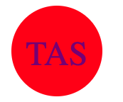
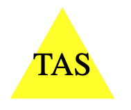

# best-SVG-Logo

## Description
 Generate an SVG element logo with text based on user input.

## Screenshots

## Video
[Click here for Video demonstration](https://youtu.be/UsjQrBnL3JY)

## Table of Contents

[Installation](#installation)

[Usage](#usage)

[Tests](#tests)

[Questions](#questions)

## Installation
 Jest testing framework is require. To installl jest type: 
 Npm install –save-dev jest

## Usage
 use "node index.js" to run the file
 The user will be prompted for input. The generated logo will be called logo.svg and placed in /examples directory

## Tests
The tests are located in /lib/shapes.test.js

To run tests, type "npm run test"

The unit tests will test the following functions located in shapes.js.

triangle.render - tested to return a blue SVG triange element

triangle.renderText - test to return purple "DOM" text.

circle.render - test to return a blue SVG circle element

circle.renderText - test to return purple "LOL" text.

square.render -test to return an orange SVG square element

saure.renderText - test to return yellow "TAS" text.

## Questions
GitHub: https://github.com/tasshroll/best-logo-generator

